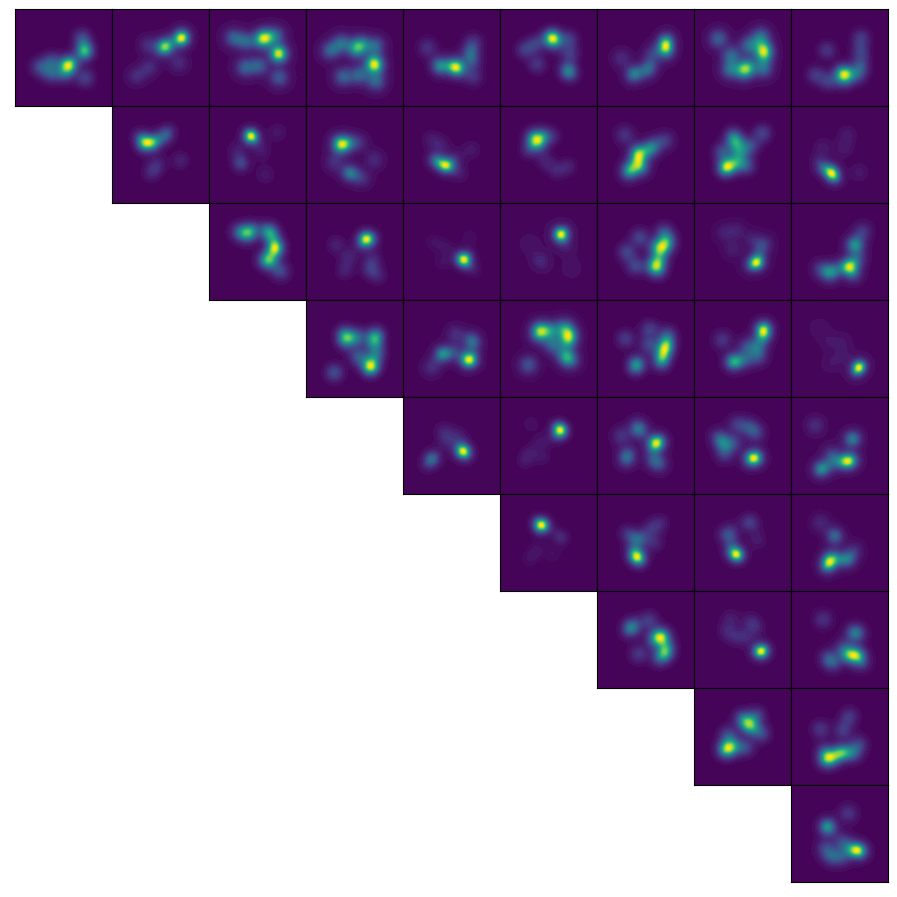
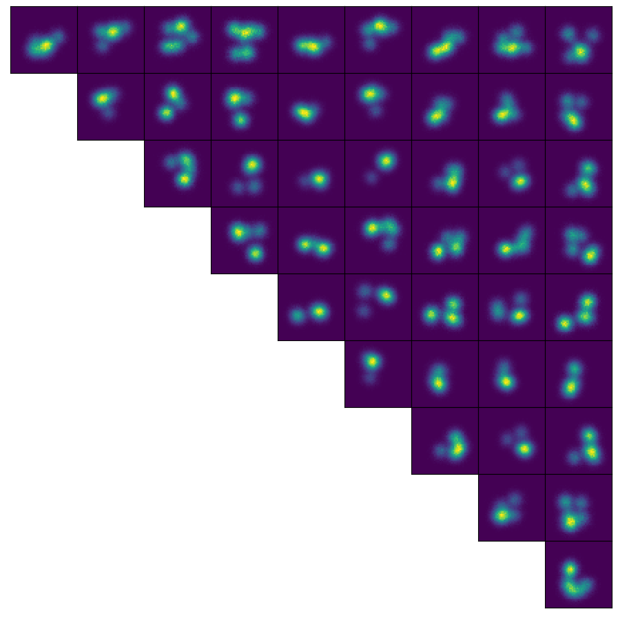

# Sylvester normalizing flows

This is a demo PyTorch repository for "Sylvester Normalizing Flows for Variational Inference" (UAI 2018).

```bibtex
@article{berg2018sylvester,
  title={Sylvester normalizing flows for variational inference},
  author={Berg, Rianne van den and Hasenclever, Leonard and Tomczak, Jakub M and Welling, Max},
  journal={arXiv preprint arXiv:1803.05649},
  year={2018}
}
```

This paper aims to **make planar flow layers more expressive** so that we don't need a ton of layers to perform variational inference for complex, high-dimensional densities. On a high level, a planar flow layer squeezes samples of size $D$ through a bottleneck of size 1, while a sylvester transformation squeezes samples of size $D$ through a bottleneck of size $M$:

- Orthogonal Sylvester flow: $1 \leq M \leq D$
- Householder Sylvester flow: $M = D$
- Triangular Sylvester flow: $M = D$

## Experiment: unconditional variational inference

The ground truth density is a mixture of 10 spherical Gaussians in a 10-dimensional space. The mean vector of each Gaussian is generated randomly from $\[-0.5, 0.5\]^10$ (but fixed across all following runs). Below is a visualization of all the 2-dimensional marginal distributions derived from the 10-dimensional mixture of Gaussians:

<p align="center">

</p>

This is a sanity-check experiment before running conditional variational inference, which is required for training VAEs. 

One may be curious, why not use the 2D densities presented in the planar flow paper? There are two main reasons: 
- I want to witness the superior ability of sylvester flows to handle high dimensional distributions.
- Householder reflections do not work well with 2x2 matrices (feel free to ask me about this in Issues).

### Training details

- Number of samples for computing the KL divergence objective: 1000
- Number of gradient steps: 20000
- Learning rate: 2e-3
- Optimizer: Adam

### Results

The plot below shows final KL (with respect to ground truth distribution) against number of layers (2, 8 or 16). Center of each error bar denotes the mean; the top of each error bar minus the bottom of each error bar equals 2 times the standard deviation around the mean. Each mean / standard deviation is calculated over 5 random seeds. 

<p align="center">

</p>

Comparison between the ground truth density with learned densities:

|                     Ground-truth density                     |                Planar flow 30 layers (seed=1)                |
| :----------------------------------------------------------: | :----------------------------------------------------------: |
|  |  |

|      Sylvester-Orthogonal (M=9) with 30 layers (seed=1)      |     Sylvester-Householder (H=5) with 30 layers (seed=1)      |
| :----------------------------------------------------------: | :----------------------------------------------------------: |
|  |  |

## Experiment: VAE training

Under construction
